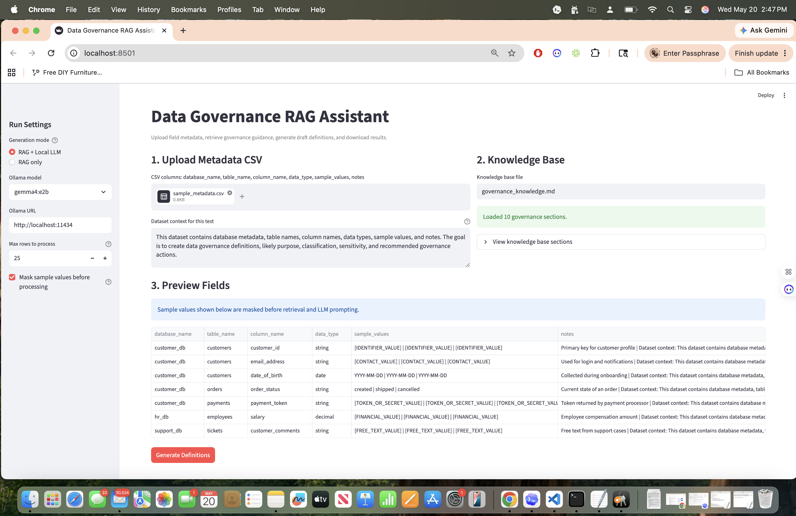
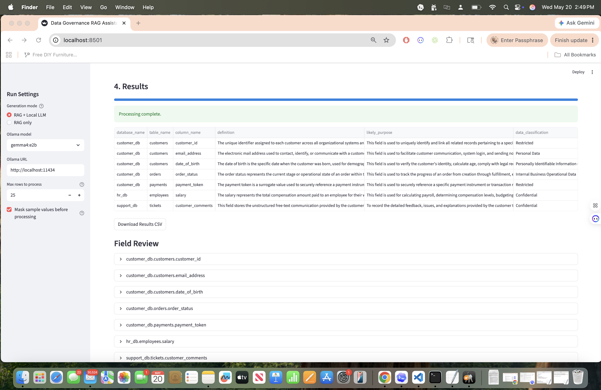

# AI-Assisted Data Governance — Data Governance Platform

A production-ready, local-first data governance platform. AI-Assisted Data Governance reads field metadata, retrieves approved policy guidance from your knowledge base, masks sensitive samples, and drafts steward-ready definitions and classifications—with optional local LLM enrichment via Ollama.

Built for data stewards and governance teams who need policy-grounded metadata enrichment without sending prompts to a cloud LLM provider.

## Documentation (executive overview & handoff)

| Doc | Purpose |
|-----|---------|
| [docs/EXECUTIVE_OVERVIEW.md](docs/EXECUTIVE_OVERVIEW.md) | 15-slide executive presentation + walkthrough script |
| [docs/WINDOWS_INSTALL.md](docs/WINDOWS_INSTALL.md) | Windows laptop install for presentation day |
| [docs/PROJECT_HANDOFF.md](docs/PROJECT_HANDOFF.md) | Full project state, architecture, next steps (AI/human continuity) |
| [web-ui/README.md](web-ui/README.md) | AI-Assisted Data Governance React web UI |
| [AGENTS.md](AGENTS.md) | Instructions for AI assistants resuming work |

## What It Does

- Ingests CSV field metadata (database, table, column, type, samples, notes)
- Retrieves relevant sections from `backend/governance_knowledge.md` (RAG)
- Masks sensitive sample values before processing
- Drafts glossary terms, classifications, sensitivity, governance actions
- Persists definitions, lineage, quality rules, trust scores, audit log
- Supports steward approval workflow and Collibra CSV export
- Lineage stitching knowledge base: `backend/lineage_knowledge.md` + `lineage_policies` DB table

## Why This Matters

Data stewards often need to define many fields with limited context. This assistant creates a first draft using metadata, sample-value patterns, and approved governance guidance. The output is intended for human review, not automatic publication.

## Architecture

```text
web-ui (React, :5173)  →  FastAPI backend (:8000)  →  SQLite governance.db
                               ↓
                          rag_governance.py
                               ↓
                     governance_knowledge.md
                               ↓
                     Ollama (:11434) — optional
                       • gemma4:e2b (LLM)
                       • nomic-embed-text (embeddings)
```

## Key Features

### Local RAG

`backend/governance_knowledge.md` acts as the live policy knowledge base. The script splits it into sections by `##` headings and retrieves the most relevant sections for each field using token similarity.

### Local LLM

The app can call Ollama at:

```text
http://localhost:11434
```

This keeps inference local when using models such as `gemma4:e2b`, `gemma4:latest`, or `llama3:latest`.

### Sample Value Masking

Sensitive samples are masked before retrieval and prompting. Examples:

```text
customer_id       -> [IDENTIFIER_VALUE]
email_address     -> [CONTACT_VALUE]
date_of_birth     -> YYYY-MM-DD
payment_token     -> [TOKEN_OR_SECRET_VALUE]
salary            -> [FINANCIAL_VALUE]
customer_comments -> [FREE_TEXT_VALUE]
```

The downloaded CSV includes masking status and masking reasons.

### Vector Semantic Retrieval

Uses `nomic-embed-text` embeddings for semantic matching and abbreviation detection.

### Collibra Export

Generates CSV/JSON exports compatible with Collibra data catalog.

### Steward Approval Workflow

Full approval/rejection workflow with audit trail and comments.

## Files

### Backend (FastAPI API)

- `backend/main.py` - FastAPI app entry
- `backend/rag_governance.py` - RAG engine, TF-IDF + vector retrieval, Ollama calls
- `backend/governance_knowledge.md` - Live policy knowledge base
- `backend/services/` - Modular services (knowledge, vector_store, semantic_mapping, etc.)
- `backend/routers/` - API endpoints
- `backend/data/governance.db` - SQLite database (gitignored)
- `backend/sample_metadata.csv` - Column-catalog format
- `backend/sample_healthcare_metadata.csv` - Healthcare example

### Web UI (React)

- `web-ui/` - Full React SPA with 10+ screens
- `web-ui/src/` - Source code
- `web-ui/public/` - Static assets

### Legacy Components (still supported)

- `streamlit_rag_app.py` - Streamlit UI (8 tabs)
- `governance_api_client.py` - Python HTTP client for Streamlit
- `README_STREAMLIT_RAG.md` - Detailed UI run guide

## Input Format

CSV columns:

```csv
database_name,table_name,column_name,data_type,sample_values,notes
```

Use `|` between sample values.

Example:

```csv
customer_db,customers,email_address,string,alex@example.com|sam@company.com,Used for customer login and notifications
```

## Run The Platform

### Terminal 1 — Backend

```bash
cd backend && source ../.venv/bin/activate
unset DATABASE_URL                 # use SQLite unless Postgres is intentional
python -c "from db.session import init_db; init_db()"
uvicorn main:app --reload --port 8000
```

### Terminal 2 — Web UI

```bash
cd web-ui && npm install && npm run dev
```

Open:

```text
http://127.0.0.1:5173
```

### Alternative: One-command setup

```bash
./scripts/restart.sh          # API :8000 + UI :5173
```

## Run From Command Line (Legacy)

RAG only:

```bash
python3 rag_governance.py --metadata sample_metadata.csv --no-llm --mask-samples
```

RAG + local Ollama model:

```bash
python3 rag_governance.py \
  --metadata sample_metadata.csv \
  --provider ollama \
  --model gemma4:e2b \
  --mask-samples
```

Save output:

```bash
python3 rag_governance.py \
  --metadata sample_metadata.csv \
  --provider ollama \
  --model gemma4:e2b \
  --mask-samples \
  > rag_results.jsonl
```

## Output

Each result includes:

- `table_description` (Brief inferred description of the table)
- `glossary_term` (Proposed business glossary term)
- `glossary_term_description` (Business definition of the glossary term)
- `logical_data_attribute_name` (Logical attribute name mapped from the column)
- `logical_data_attribute_description` (Description of the logical attribute)
- `definition` (One-sentence business definition of the field)
- `likely_purpose` (How the field is likely used in business)
- `data_classification` (e.g. Public, Internal, Confidential, Restricted)
- `sensitivity` (Low, Medium, High)
- `governance_actions` (Actionable governance checklist)
- `retrieved_context` (Relevant knowledge-base section headers)
- `sample_values_masked` (Boolean flag showing if values were masked)
- `masking_reasons` (List of masking categories applied)
- `source` (Method/model used to generate results)

## Steward Review Model

The assistant creates draft suggestions. A data steward should review and approve definitions before they are published to a business glossary, data catalog, Collibra, or downstream governance workflow.

## Security Posture

- Runs locally for prototype testing.
- Does not require a cloud LLM API.
- Masks sensitive sample values before prompting.
- Uses safe sample metadata for fast analysis.
- Outputs are review artifacts, not final policy decisions.

## Screenshots





## Roadmap

- [x] Add business glossary term generation as a separate output.
- Add approval status and steward comments.
- Add vector search for semantic RAG retrieval.
- Add Collibra export mapping.
- Add audit logs for prompt/version/model/knowledge-base evidence.

## Disclaimer

This is a prototype for governance workflow experimentation. Do not upload production-sensitive data unless approved by your organization and protected by appropriate controls.
