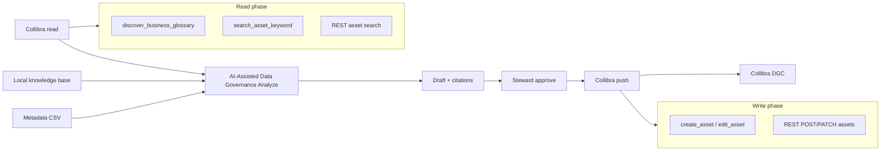

# Collibra MCP Integration — Read, Propose, Push

AI-Assisted Data Governance can connect to your **Collibra Data Governance Center** so that:

1. **Analyze** uses existing glossary terms as context (not only local `governance_knowledge.md`).
2. **Stewards approve** definitions in AI-Assisted Data Governance (human gate unchanged).
3. **Push** approved terms back to Collibra as business glossary assets.

This guide covers the open-source **[Collibra MCP server (chip)](https://github.com/collibra/chip)** and the **REST API** path built into AI-Assisted Data Governance today.

---

## Architecture



| Phase | AI-Assisted Data Governance | Collibra (via MCP or REST) |
|-------|----------|----------------------------|
| **Read** | Build query from column + table + notes | `discover_business_glossary`, `search_asset_keyword`, or REST search |
| **Propose** | Align `glossary_term`, definition, logical attribute | Show matches; steward picks link vs create new |
| **Approve** | `approval_status = approved` | No change in Collibra yet |
| **Push** | After explicit push or auto-push flag | `create_asset` / `edit_asset` (MCP) or REST create/update |

---

## Prerequisites

- Collibra DGC instance (URL + user with read/write on glossary).
- For **MCP (chip)**:
  - Download [chip release](https://github.com/collibra/chip/releases) for your OS.
  - Config: `~/.config/collibra/mcp.yaml` or env `COLLIBRA_MCP_API_URL`, `COLLIBRA_MCP_API_USR`, `COLLIBRA_MCP_API_PWD`.
- For **REST (built into AI-Assisted Data Governance backend)**:
  - Same URL/credentials via `COLLIBRA_API_URL`, `COLLIBRA_API_USERNAME`, `COLLIBRA_API_PASSWORD`.

**Note:** Chip MCP tools map to Collibra APIs. AI-Assisted Data Governance’s REST mode works without running chip; MCP mode (future HTTP bridge) runs chip as a sidecar for the same operations.

---

## Environment variables

Add to your backend environment (or `.env` loaded before `uvicorn`):

```bash
# Enable integration
COLLIBRA_ENABLED=true

# Collibra instance (no trailing slash)
COLLIBRA_API_URL=https://your-tenant.collibra.com

# Service account or personal user (prefer dedicated integration user)
COLLIBRA_API_USERNAME=govassist-integration
COLLIBRA_API_PASSWORD=***

# Where new business terms are created
COLLIBRA_GLOSSARY_DOMAIN_NAME=Business Glossary

# Optional: asset type name (default: Business Term)
COLLIBRA_BUSINESS_TERM_TYPE_NAME=Business Term

# After steward approval, push automatically (optional)
COLLIBRA_AUTO_PUSH_ON_APPROVE=false

# Optional: path to chip binary for MCP stdio bridge (advanced)
# COLLIBRA_MCP_CHIP_PATH=/usr/local/bin/chip-mac-arm64
```

---

## AI-Assisted Data Governance API (REST integration)

| Endpoint | Purpose |
|----------|---------|
| `GET /api/collibra/status` | Is Collibra configured? Mode (rest / disabled) |
| `POST /api/collibra/glossary/match` | Search existing terms for a column context |
| `POST /api/collibra/push/{definition_id}` | Push one **approved** definition to Collibra |
| `POST /api/collibra/push-approved` | Push all approved rows with `collibra_sync_status=pending` |

### Match example

```bash
curl -X POST http://127.0.0.1:8000/api/collibra/glossary/match \
  -H "Content-Type: application/json" \
  -d '{
    "database_name": "clinical_ehr",
    "table_name": "patients",
    "column_name": "mrn",
    "glossary_term": "Medical Record Number",
    "definition": "Primary medical record number for a patient."
  }'
```

Response includes `matches[]` with Collibra asset id, name, definition snippet, and suggested action (`link` | `create_new`).

### Push example (after approval)

```bash
curl -X POST http://127.0.0.1:8000/api/collibra/push/{definition_id}
```

---

## UI workflow

1. **Analyze columns** → Advanced → check **Use Collibra glossary** (when status shows connected).
2. Open a result → see **Collibra matches** (if any).
3. **Approve definitions** → approve as today.
4. **Catalog export** → **Collibra** panel → **Push approved to Collibra** (or enable auto-push).

CSV export remains available for manual import.

---

## MCP tools mapping (chip)

| AI-Assisted Data Governance step | Chip MCP tool | REST equivalent |
|---------------|---------------|-----------------|
| Natural-language glossary discovery | `discover_business_glossary` | Search + AI copilot scope |
| Keyword search | `search_asset_keyword` | `GET /rest/2.0/assets` |
| Term details | `get_asset_details` | `GET /rest/2.0/assets/{id}` |
| Create term | `create_asset` | `POST /rest/2.0/assets` |
| Update definition | `edit_asset` (`update_attribute`) | `PATCH /rest/2.0/assets/{id}` |

Write tools need scopes: catalog write, and `create_asset` / `edit_asset` permissions for the integration user.

---

## Running chip alongside AI-Assisted Data Governance (optional)

For Cursor or other MCP clients:

```json
{
  "mcpServers": {
    "collibra": {
      "type": "stdio",
      "command": "/path/to/chip-mac-arm64"
    }
  }
}
```

AI-Assisted Data Governance backend currently uses **REST** directly for reliability in FastAPI. A future release can call chip over HTTP transport when `COLLIBRA_MCP_HTTP_URL` is set.

---

## Security

- Use a dedicated integration user with minimum scopes.
- Never commit passwords; use secrets manager or env vars.
- Push only runs on **approved** definitions unless you explicitly enable auto-push.
- Audit log records `collibra_push` actions.

---

## Roadmap

| Item | Status |
|------|--------|
| REST search + push | Implemented in backend |
| UI: match display + push button | Implemented |
| Analyze flag `use_collibra` | Implemented |
| Native MCP HTTP client to chip | Planned |
| Link column → physical asset in Collibra | Planned (`add_relation`) |
| Auto-map data class from classification | Planned (`add_data_classification_match`) |

---

## Troubleshooting

| Issue | Check |
|-------|--------|
| Status `disabled` | `COLLIBRA_ENABLED=true` and URL/credentials set |
| 401 from Collibra | User/password; API URL includes `https://` |
| No matches | Term naming differs — try keyword search; broaden column notes |
| Push fails | User has create rights; domain name exists; term not duplicate |
| MCP vs REST | AI-Assisted Data Governance UI shows `mode: rest` until MCP HTTP bridge is configured |
